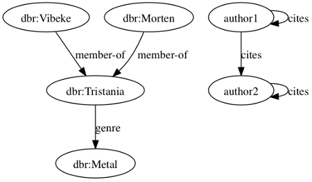
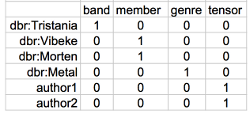

Ext-RESCAL
=================

Scalable Tensor Factorization
------------------------------

Ext-RESCAL is a memory efficient implementation of [RESCAL](http://www.cip.ifi.lmu.de/~nickel/data/slides-icml2011.pdf), a state-of-the-art algorithm for DEDICOM-like tensor factorization. Ext-RESCAL is written in Python and leverages on the SciPy Sparse module.

Current Version
------------
[0.7](https://github.com/nzhiltsov/Ext-RESCAL/archive/0.7.zip)

Features
------------

* 3-D sparse tensor factorization [1]
* Joint 3-D sparse tensor and 2-D sparse matrix factorization (extended version) [2-3]
* Handy input format
* Support of float values as tensor values
* The implementation provably scales well to the domains with millions of nodes on the affordable hardware

[1] M. Nickel, V. Tresp, H. Kriegel. A Three-way Model for Collective Learning on Multi-relational Data // Proceedings of the 28th International Conference on Machine Learning (ICML'2011). - 2011. 

[2] M. Nickel, V. Tresp, H. Kriegel. Factorizing YAGO: Scalable Machine Learning for Linked Data // Proceedings of the 21st international conference on World Wide Web (WWW'2012). - 2012.

[3] Nickel, Maximilian. Tensor factorization for relational learning. Diss. München, Ludwig-Maximilians-Universität, Diss., 2013, 2013.

Expected Applications
----------------------
* Link Prediction
* Collaborative Filtering
* Entity Search

Prerequisites
----------------------
* Python 2.7+
* Numpy 1.6+
* SciPy 0.12+

Usage Examples
----------------------

1) Let's imagine we have the following semantic graph:

Each tensor slice represents an adjacency matrix of the corresponding predicate (member-of, genre, cites). We run the RESCAL algorithm to decompose a 3-D tensor with 2 latent components and zero regularization on the test data:

<pre>python rescal.py --latent 2 --lmbda 0 --input tiny-example --outputentities entity.embeddings.csv --outputfactors latent.factors.csv --log rescal.log</pre>

The test data set represents a tiny entity graph of 3 adjacency matrices (frontal tensor slices) in the row-column representation. See the directory <i>tiny-example</i>.  Ext-RESCAL will output the latent factors for the entities into the file <i>entity.embeddings.csv</i>.

2) Then, we assume that there is an entity-term matrix:

Then, we run the extended version of RESCAL algorithm to decompose a 3-D tensor and 2-D matrix with 2 latent components and regularizer equal to 0.001 on the test data (entity graph and entity-term matrix):

<pre>python extrescal.py --latent 2 --lmbda 0.001 --input tiny-mixed-example --outputentities entity.embeddings.csv --outputterms term.embeddings.csv --outputfactors latent.factors.csv --log extrescal.log</pre>

If we plot the resulting embeddings, we would get the following picture, which reveals the similarity of entities and words in the same latent space:

In case of float values in the entity-term matrix (e.g. TF-IDF weighted vectors), one may use *extrescal-float.py* script for calculation, providing the file *ext-matrix-elements* in the *input* directory, which contains the values.

Development and Contribution
----------------------

Ext-RESCAL has been developed by [Nikita Zhiltsov](http://linkedin.com/in/nzhiltsov). This project is a fork of the original code base provided by [Maximilian Nickel](http://www.cip.ifi.lmu.de/~nickel/) (see [his latest implementation](https://github.com/mnick/scikit-tensor) available under GPL license). Ext-RESCAL may contain some bugs, so, if you find any of them, feel free to contribute the patches via pull requests into the _develop_ branch. If you want to contribute, but have no idea how, please ask on [Ext-RESCAL Google Group](https://groups.google.com/d/forum/ext-rescal).

Support
-------
Feel free to ask any questions on [Ext-RESCAL Google Group](https://groups.google.com/d/forum/ext-rescal). 

Release Notes
------------
0.7 (October 8, 2014):

* Grealy improve the memory consumption for all scripts after refactoring to using csr_matrix

0.6 (March 21, 2014):

* Make the extended algorigthm output fixed (by replacing random initialization)
* Add handling of float values in the extended task
* Add the util for matrix pseudoinversion
* Switch to Apache License 2.0

0.5 (March 29, 2013):

* Greatly improve the convergence speed via initialization of starting matrices with eigenvectors

0.4 (March 14, 2013):

* Add efficient computation of the exact objective value via trick with trace

0.3 (March 12, 2013):

* Fix random sampling for the basic task
* Add output of latent factors

0.2 (February 26, 2013): 

* Add an opportunity to approximate the objective function via random sampling
* Bug fixes
* Change the default settings

0.1 (January 31, 2013):

* The basic implementation of both the algorithms

Credit
----------------------

The original algorithms are an intellectual property of the authors of the cited papers.

Disclaimer
---------------------
The author is not responsible for implications from the use of this software.

License
---------------------

Licensed under the Apache License, Version 2.0: http://www.apache.org/licenses/LICENSE-2.0

Citation
----------------------
If you have used this software in your research work, please cite the following paper:

Zhiltsov, N., Agichtein, E. _Improving Entity Search over Linked Data by Modeling Latent Semantics._ Proceedings of the International Conference on Information and Knowledge Management (CIKM 2013). ACM, 2013.
